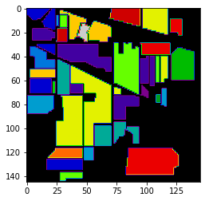

### Example: Hyperspectral Data Analysis using EMPR Spectral Signatures

This example demonstrates how to use **HDMRLib** to extract representative spectral signatures from hyperspectral datasets like Indian Pines. We utilize **Enhanced Multivariance Products Representation (EMPR)** to decompose the 3D tensor into lower-dimensional components that represent the core spectral characteristics of the data. By isolating the behavior of the third dimension (spectral bands), we reach an average spectral signature that captures the essential information of the scene.

---

#### 1. Visualizing the Dataset
Before processing, we view the spatial distribution of the hyperspectral scene to understand the terrain and ground truth classifications present in the data.



#### 2. Implementation in HDMRLib
The following script loads the Indian Pines dataset, isolates a spatial crop, and uses the `EMPR` class to extract the spectral signature components.

```python
import numpy as np
import scipy.io as sio
import matplotlib.pyplot as plt
from hdmrlib import EMPR

# 1. Load Hyperspectral Dataset (Indian Pines)
# Using corrected data which contains 200 spectral bands
mat_data = sio.loadmat('Indian_pines_corrected.mat')
dataset = mat_data['indian_pines_corrected']

# 2. Data Preprocessing
# Crop to a representative spatial segment for analysis
hsi_tensor = dataset[:, :, :].astype(np.float64)

# 3. Apply EMPR Decomposition
# Pass the data tensor directly and specify the order.
# order=1 calculates the scalar and 1-dimensional components.
empr = EMPR(hsi_tensor, order=1)
components = empr.components()

# 4. Extract Spectral Signature
# In a 3D tensor H(n1, n2, n3), the 1D component for the 3rd dimension (index 2)
# represents the behavior along the spectral dimension.
spectral_component = components[(2,)]

# 5. Visualization
plt.figure(figsize=(10, 4))
plt.plot(spectral_component)
plt.title("Representative Spectral Signature (EMPR Component $h_3$)")
plt.xlabel("Band Number")
plt.ylabel("Intensity")
plt.show()
```

#### 3. Analyzing the Signature
The extracted component $h_3$ provides a decorrelated, summarized view of the spectral bands, serving as a clean baseline signature for the cropped region. 


---

#### 4. Key Benefits
* **Dimension Isolation:** EMPR allows each element to refer specifically to the attitude of a certain dimension, such as the spectral characteristics of the image.
* **Feature Extraction:** The components serve as unique features that can be employed in further tasks such as classification or dimensionality reduction.
* **Noise Reduction:** By focusing on the primary EMPR components and neglecting the residual, the resulting signature is cleaner than a raw average of the noisy bands.
